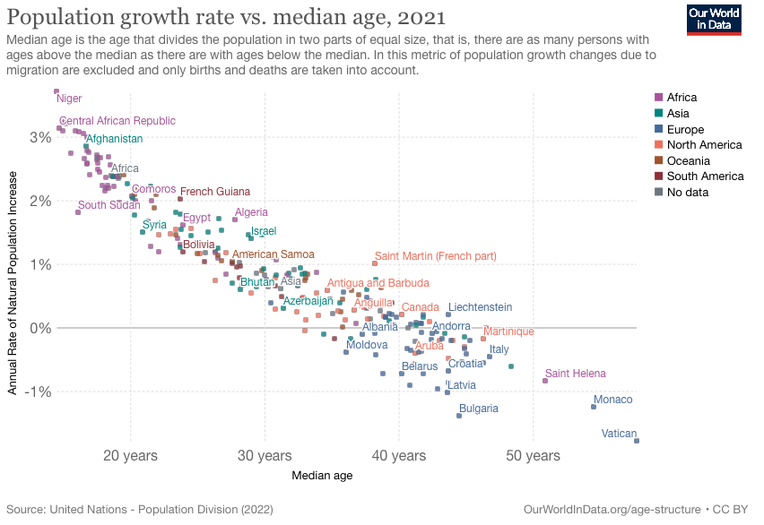
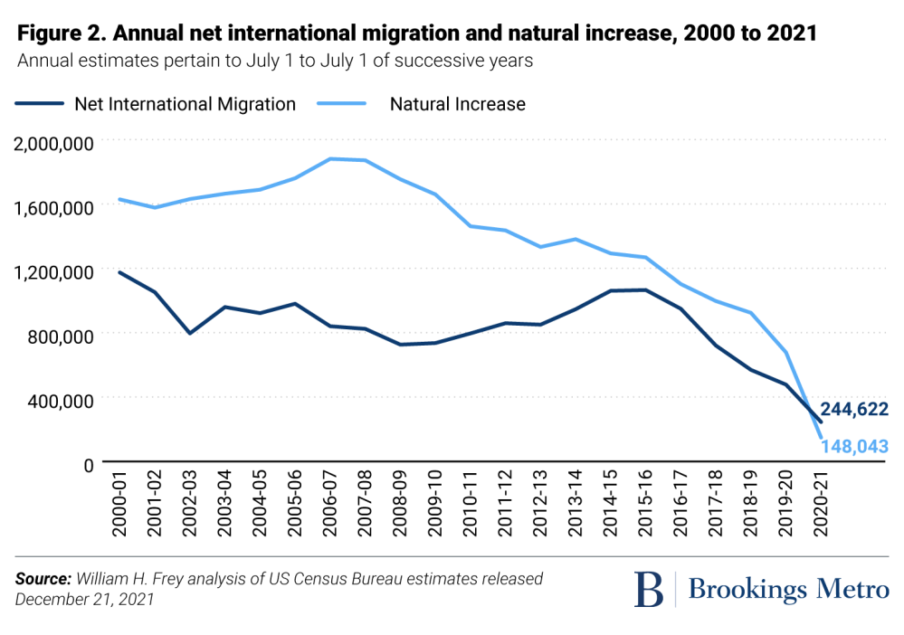

```{r, echo = FALSE}
library(knitr)
library(magrittr)
library(dplyr) 
library(ggplot2)
```

Homework text and questions: Copyright Miles Chen. Do not post, share, or distribute without permission.

# Academic Integrity Statement

By modifying this statement , I, **Your Name Here**, declare that all of the work in this assignment is my own original work. At no time did I look at the code of other students nor did I search for code solutions online. I understand that plagiarism on any single part of this assignment will result in a 0 for the entire assignment and that I will be referred to the dean of students.

# Part 1: Textbook Chapter 2, Exercise 3
## Problem 3 (Medium): Find two graphs published in a newspaper or on the internet in the last two years.

## Identify a graphical display that you find compelling. What aspects of the display work well, and how do these relate to the principles established in this chapter? Include a screen shot of the display along with your solution.

## Identify a graphical display that you find less than compelling. What aspects of the display don’t work well? Are there ways that the display might be improved? Include a screen shot of the display along with your solution.

## Example of a compelling graphic display


```{r, echo = FALSE, out.height = "2.5in"}
# you can edit the out.height to a different size
 # replace this file name with the one you chose

```


Replace the following text with your response:

This image was taken from: <https://www.brookings.edu/research/u-s-population-growth-has-nearly-flatlined-new-census-data-shows/>
<https://ourworldindata.org/world-population-growth>

Aspects that work well:

+ The first graph uses different colors to represent the countries, and contains labels on top of the points.

+  Also, the graph is scaled properly with suitable domain and range, which is helpful for clarify the information.

## Example of a graphic display that is less compelling

The second graph on the right-hand-side, is less compelling because it doesn't has a label for both of the x and y axis. Without know the correct name or unit, it might lead to a misunderstanding of the information.


# Part 2: Textbook Chapter 2, Exercise 6

+ What quantity is being shown on the y-axis of each plot?

    The number of women who have an unplanned pregnancy over 10 years
    
+ List the variables displayed in the data graphic, along with the units and a few typical values for each.

    The year labeled on the x axis, and the color change when the y value pass through a specific amount of value(25 to 50, and more than 50).
    
+ List the visual cues used in the data graphic and explain how each visual cue is linked to each variable.

    The change of color, from gray to yellow and red, along the increase of number will drag more attention to the audience to focus on the change. Also, the explanation at the upper left corner tells the audience the ratio. 

+ Examine the graphic carefully. Describe, in words, what information you think the data graphic conveys. Do not just summarize the data—interpret the data in the context of the problem and tell us what it means. (Note: information is meaningful to human beings—it is not the same thing as data.)

    By comparing the number of women who will have an unplanned pregnancy over a given number of years, we notice that the efficiency of different type of birth control. Also, refer to the gap between the typical use line and dot line in each graph, we notice that most of the birth controls are insufficient.  


# Part 3: Textbook Chapter 3, Exercise 1

```{r}
library(babynames)
babynames%>%
  filter(name=="Angelica")%>%
  ggplot(aes(x=year,
             y=n))+
  geom_point(size = 0.5,color = "darkgreen")

```

The graph represents the number of baby who named Angelica over time. From the graph we can see that there is a great amount of increase start around 1950 and get to the peak around 1992, the start descending after this. 


# Part 4: Textbook Chapter 3, Exercise 2

```{r}
library(nasaweather)
data(storms, package = "nasaweather")
nasaweather::storms%>%
  ggplot(aes(
    x = pressure,
    y = wind,
    color = type 
  ))+
  geom_point()

```


# Part 5: Textbook Chapter 3, Exercise 6
```{r}
data(MLB_teams, package = "mdsr")
mdsr::MLB_teams%>%
  ggplot(
    aes(x = W,
        y = L,
        color = teamID,
        shape = lgID)
  )+
  labs(x = "Weight", y = "Height")+
  geom_point()
```
# Part 6: Textbook Chapter 3, Exercise 7
```{r}
# a.
library(mosaicData)
data(RailTrail, package = "mosaicData")
mosaicData::RailTrail%>%
  ggplot(
    aes(x=hightemp,
        y=volume)
  )+
  geom_point()

```
```{r}
# b.
mosaicData::RailTrail%>%
  filter(weekday==TRUE)%>%
  ggplot(
    aes(x=hightemp,
        y=volume)
  )+
  geom_point()


mosaicData::RailTrail%>%
  filter(weekday==FALSE)%>%
  ggplot(
    aes(x=hightemp,
        y=volume)
  )+
  geom_point()

```

```{r}
mosaicData::RailTrail%>%
  filter(weekday==TRUE)%>%
  ggplot(
    aes(x=hightemp,
        y=volume)
  )+
  geom_point()+
  stat_smooth(method = "lm",
              geom = "smooth")


mosaicData::RailTrail%>%
  filter(weekday==FALSE)%>%
  ggplot(
    aes(x=hightemp,
        y=volume)
  )+
  geom_point()+
  stat_smooth(method = "lm",
              geom = "smooth")
```


