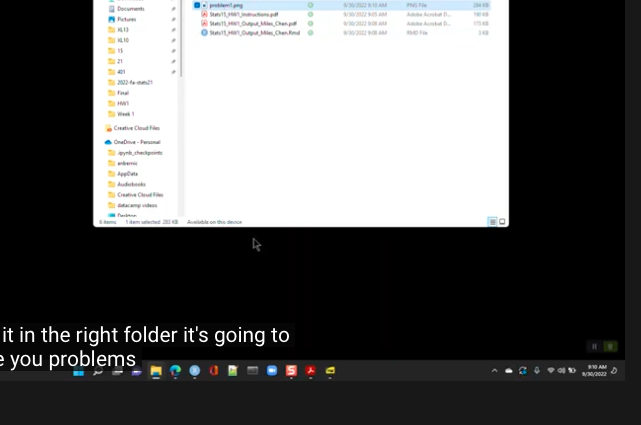

```{r, echo = FALSE}
library(knitr)
```

Homework text and questions: Copyright Miles Chen. Do not post, share, or distribute without permission.

# Academic Integrity Statement

By modifying this statement , I, **Your Name Here**, declare that all of the work in this assignment is my own original work. At no time did I look at the code of other students nor did I search for code solutions online. I understand that plagiarism on any single part of this assignment will result in a 0 for the entire assignment and that I will be referred to the dean of students.

# Part 1: Textbook Chapter 2, Exercise 3

## Example of a compelling graphic display

```{r, echo = FALSE, out.height = "3in"}
# you can edit the out.height to a different size
 # replace this file name with the one you chose
```

Replace the following text with your response:

This image was taken from: <https://www.latimes.com/projects/california-coronavirus-cases-tracking-outbreak/>

Aspects that work well:

+ reason 1
+ reason 2

## Example of a graphic display that is less compelling

Replace this text. Insert a code chunk that will include the graphic.


# Part 2: Textbook Chapter 2, Exercise 6

+ What quantity is being shown on the y-axis of each plot?
    + Write your response
+ List the variables displayed in the data graphic, along with the units and a few typical values for each.
    + Write your response
+ List the visual cues used in the data graphic and explain how each visual cue is linked to each variable.
    + Write your response
+ Examine the graphic carefully. Describe, in words, what information you think the data graphic conveys. Do not just summarize the data—interpret the data in the context of the problem and tell us what it means. (Note: information is meaningful to human beings—it is not the same thing as data.)
    + Write your response


# Part 3: Textbook Chapter 3, Exercise 1

Follow the instructions in the instruction file.

# Part 4: Textbook Chapter 3, Exercise 2

Follow the instructions in the instruction file.


# Part 5: Textbook Chapter 3, Exercise 6

Follow the instructions in the instruction file.

# Part 6: Textbook Chapter 3, Exercise 7

Follow the instructions in the instruction file.


